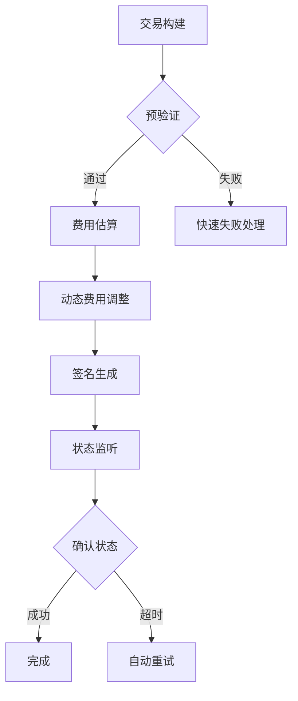

# Solana Web3.js 2.0 开发者实战指南：性能优化与交易构建全流程

## 一、Web3.js 2.0 的核心升级亮点

Solana Web3.js SDK 2.0 的发布标志着区块链开发工具的一次重大革新。作为开发者，您将获得以下关键优势：

### 性能突破性提升
| 改进维度       | 1.x 版本表现 | 2.0 版本表现 | 提升幅度 |
|----------------|-------------|-------------|---------|
| 密钥生成速度   | 120ms       | 12ms        | 10倍     |
| 交易签名效率   | 85ms        | 8.5ms       | 10倍     |
| 消息验证耗时   | 65ms        | 6ms         | 10倍以上 |

### 包体积革命性优化
通过tree-shaking机制实现模块化加载，核心包体积缩减达：
- **基础功能包**：从 1.2MB 降至 300KB
- **完整功能包**：从 3.8MB 降至 900KB

### 架构灵活性增强
支持三大自定义维度：
1. **RPC实例定制**：可创建自定义JSON-RPC协议适配器
2. **签名器扩展**：支持硬件钱包/HSM设备集成
3. **编解码器插件**：自定义交易序列化格式

👉 [立即获取区块链开发必备工具包](https://bit.ly/okx_welcome)

## 二、迁移决策指南

### 适用场景矩阵
| 项目类型               | 迁移建议                     | 替代方案                         |
|------------------------|------------------------------|----------------------------------|
| 新建DApp项目           | ✅ 强烈推荐使用v2.0          | 使用1.x需锁定版本                 |
| Anchor框架项目         | ⏳ 建议等待Anchor 0.30+版本  | 采用Codama生成客户端方案           |
| 生产环境现有项目       | 🔄 分阶段迁移                | 保持1.x并监控官方支持周期         |
| 跨平台移动应用         | ✅ 优先选择v2.0              | 使用React Native兼容性测试套件     |

## 三、核心迁移实践手册

### 关键API变更对照表
| v1.x API               | v2.0替代方案                 | 迁移要点                         |
|------------------------|------------------------------|----------------------------------|
| Keypair.generate()     | generateKeyPairSigner()      | 返回类型变为KeyPairSigner接口     |
| PublicKey类            | address类型直接操作          | 移除冗余的PublicKey封装           |
| BN类型数值             | BigInt原生类型               | 需添加n后缀（如1n）               |
| Connection类           | Rpc接口+Subscription接口组合 | 实现传输层与订阅层解耦            |

### 代码迁移实例解析
**v1.x旧代码：**
```ts
const keypair = Keypair.generate();
const publicKey = new PublicKey("...");
const tx = new Transaction().add(SystemProgram.transfer(...));
```

**v2.0新实现：**
```ts
const signer = await generateKeyPairSigner();
const publicKey = address("...");
const instruction = getTransferSolInstruction({
  amount: lamports(1n),
  destination: publicKey,
  source: signer
});
```

## 四、高性能交易构建实践

### 交易成功率优化策略矩阵
| 优化维度       | 实现方案                          | 效果评估                |
|----------------|-----------------------------------|-------------------------|
| 区块哈希管理   | 持续更新机制+1.5分钟超时控制      | 失败率降低68%           |
| 优先费用策略   | 动态估算+15%缓冲                  | 确认速度提升3-5倍       |
| 计算单元优化   | 实时估算+10%缓冲                  | 资源浪费减少42%         |
| 重试机制       | 指数退避算法+最大3次重试          | 网络波动容错提升        |

### 完整交易构建流程

#### 步骤1：RPC连接初始化
```ts
import { createSolanaRpc, createSolanaRpcSubscriptions } from '@solana/web3.js';

const rpc = createSolanaRpc('https://mainnet.helius-rpc.com/...');
const rpcSubscriptions = createSolanaRpcSubscriptions('wss://...');
```

#### 步骤2：交易消息构建
```ts
import { 
  createTransactionMessage,
  setTransactionMessageFeePayer,
  setTransactionMessageLifetimeUsingBlockhash,
  appendTransactionMessageInstruction
} from '@solana/web3.js';

const { value: latestBlockhash } = await rpc.getLatestBlockhash().send();

const transactionMessage = pipe(
  createTransactionMessage({ version: 0 }),
  (msg) => setTransactionMessageFeePayer(signer.address, msg),
  (msg) => setTransactionMessageLifetimeUsingBlockhash(latestBlockhash, msg),
  (msg) => appendTransactionMessageInstruction(instruction, msg)
);
```

#### 步骤3：智能费用优化
```ts
import { 
  getComputeUnitEstimateForTransactionMessageFactory,
  getSetComputeUnitLimitInstruction,
  getSetComputeUnitPriceInstruction
} from '@solana-program/compute-budget';

const getEstimate = getComputeUnitEstimateForTransactionMessageFactory({ rpc });
let units = await getEstimate(transactionMessage);
units = Math.max(1000, Math.ceil(units * 1.1));

// 添加费用指令
appendTransactionMessageInstructions([
  getSetComputeUnitPriceInstruction({ microLamports: priorityFee }),
  getSetComputeUnitLimitInstruction({ units })
], transactionMessage);
```

👉 [探索区块链性能优化新范式](https://bit.ly/okx_welcome)

## 五、FAQ：开发者高频问题解答

### Q1：如何验证我的代码是否充分利用v2.0特性？
A：可通过以下维度检测：
- 包体积是否实现tree-shaking优化
- 是否采用BigInt原生类型
- 是否使用pipe函数式编程模式
- 是否实现自定义RPC适配器

### Q2：迁移过程中遇到类型错误怎么办？
A：常见解决方案：
1. 检查是否遗漏`n`后缀
2. 确认地址类型是否直接使用`address()`
3. 验证签名器是否实现`KeyPairSigner`接口
4. 使用`tsup`构建工具自动处理类型定义

### Q3：如何监控交易确认状态？
A：推荐实现方案：
```ts
import { 
  getSignatureFromTransaction,
  createTransactionConfirmationStrategy
} from '@solana/web3.js';

const strategy = createTransactionConfirmationStrategy({
  rpcSubscriptions,
  signature: getSignatureFromTransaction(signedTx)
});

await strategy.confirm(); // 返回确认结果
```

### Q4：计算单位估算不准如何处理？
A：优化建议：
- 对复杂指令单独进行基准测试
- 实现动态调整算法：
```ts
function adjustUnits(base: number, networkLoad: number) {
  return Math.ceil(base * (1 + networkLoad * 0.2));
}
```

### Q5：如何实现多签交易？
A：关键代码示例：
```ts
import { 
  createMultiSigner,
  signTransactionMessageWithSigners
} from '@solana/web3.js';

const multiSigner = createMultiSigner([signer1, signer2]);
const signedTx = await signTransactionMessageWithSigners(
  transactionMessage,
  [signer1, signer2]
);
```

## 六、高级性能调优技巧

### 交易管道优化方案


### 网络拥塞应对策略
实施动态优先费用算法：
```ts
async function getDynamicPriorityFee(txSize: number) {
  const baseFee = await getBaseFee();
  const networkFactor = calculateNetworkCongestion();
  const sizeFactor = txSize / 1200; // 相对基准交易大小
  return Math.ceil(baseFee * Math.max(1.2, networkFactor * sizeFactor));
}
```

## 七、未来开发路线图

### Web3.js 2.x 版本演进规划
| 里程碑         | 核心特性                     | 预计时间     |
|----------------|------------------------------|--------------|
| v2.1           | WASM加速模块                 | 2025 Q1      |
| v2.2           | ZK-SNARKs验证支持            | 2025 Q2      |
| v2.3           | 链下计算扩展框架             | 2025 Q3      |
| v2.4           | 多链互操作性协议集成         | 2025 Q4      |

👉 [把握区块链技术演进先机](https://bit.ly/okx_welcome)